# Storytelling: Turn Your Ideas Into Complete Narratives

Transform a simple story idea into a fully-written, multi-chapter narrative. **WillWrite** is an AI-powered storytelling partner that handles the heavy lifting—outline generation, chapter planning, scene development, and revision—so you can focus on your creative vision.

## What It Does ?

**Create complete stories in minutes.** You provide a story prompt. The system generates:

- A structured outline with plot, characters, and themes
- Individual chapters with detailed chapter outlines
- Four polished scenes per chapter
- Multiple revision passes for consistency and quality
- Session persistence—pause and resume anytime

**Powered by advanced AI orchestration.** Built on LangGraph and LangChain with multi-LLM provider support, knowledge-base integration, and intelligent retrieval-augmented generation (RAG).

## Getting Started

### Installation

```bash
# Basic installation
pip install storytelling

# With full features (web fetching, local embeddings, cloud logging)
pip install storytelling[all]
```

### Your First Story

```bash
# Create a prompt file
echo "A detective discovers a mysterious library" > my_prompt.txt

# Generate your story
storytelling --prompt my_prompt.txt --output my_story.md
```

Your completed story appears in `my_story.md`.

### Using Your Own LLMs

```bash
# With local Ollama
storytelling --prompt prompt.txt \
  --initial-outline-model "ollama://mistral@localhost:11434"

# With Google Gemini
storytelling --prompt prompt.txt \
  --initial-outline-model "google://gemini-2.5-flash"
```

## Key Features

**Flexible AI Providers**
- Google (Gemini, PaLM)
- Ollama (local models)
- OpenRouter (community models)
- Custom endpoints

**Knowledge-Aware Generation**
- Integrate your own knowledge bases
- Web content retrieval
- Semantic context enhancement
- Consistent worldbuilding

**Session Management**
- Pause and resume at any stage
- Checkpoint-based recovery
- Narrative branching
- Full generation history

**Production Ready**
- Comprehensive logging with Langfuse
- Type-safe with Pydantic
- Configurable for various use cases
- Extensible architecture

## 🏗️ Architecture Overview

The storytelling package is a **[LangGraph](https://github.com/langchain-ai/langgraph) event-driven pipeline** built on LangChain — graphs manage stateful, conditional generation workflows while chains orchestrate individual LLM calls. LangGraph graphs are state machines for LLMs. Structurally, the pipeline is a **Structural Tension Chart (STC) state machine**: the user's prompt is *current reality*, the completed narrative is the *desired state*, and the graph executes state transitions until tension resolves.

> *See [`llms/imported/llms-langchain.txt`](llms/imported/llms-langchain.txt) for the LangChain/LangGraph reference that shaped this architecture.*

### Story Generation Pipeline

> Source: [`storytelling/graph.py`](storytelling/graph.py) — `create_graph()`

```mermaid
flowchart TD
    USER([User Prompt]) --> BC
    SESS([Resume Session]) -.->|checkpoint resume| CH

    subgraph GRM ["🌱 Germination — tension_established"]
        BC["extract_base_context\nmeta-instructions"]
        SE["generate_story_elements\ncharacters · themes · plot"]
        IO["generate_initial_outline\nfull story structure"]
        CD["determine_chapter_count"]
        BC --> SE --> IO --> CD
    end

    subgraph ASM ["🔄 Assimilation — action_step_completed loops"]
        CH["generate_chapter\nscene by scene"]
        BT["revise_buzz_terms\nstyle_glossary.yaml"]
        CR["critique_chapter"]
        CK{"check_chapter_complete\nmoment_of_truth"}
        RV["revise_chapter"]
        IX["increment_chapter_index"]
        CH --> BT --> CR --> CK
        CK -->|"revise — oscillating pattern"| RV
        RV --> CR
        CK -->|"increment — advancing pattern"| IX
    end

    subgraph CPL ["✨ Completion — tension_resolve"]
        FS["generate_final_story\ncomplete narrative"]
    end

    CD --> CH
    IX -->|"more chapters"| CH
    IX -->|"finalize"| FS
    FS --> OUT([Complete Story])

    KB[("Knowledge Base\nRAG")] --> IO
    KB --> CH
    LLM{{"LLM Providers\nGoogle · Ollama · OpenRouter"}} -.-> GRM
    LLM -.-> ASM
    SM["Session Manager\ncheckpoints"] -.-> BC
    SM -.-> CH
    SM -.-> FS
    LF[/"Langfuse Tracing\nplanned"/] -.-> FS
```



### Story Pipeline as STC State Machine

Mapping [Robert Fritz's creative process](llms/llms-stc-state-machine.md) to the pipeline — the **structural tension IS the event-driven energy** driving state transitions. Creative orientation as architecture: resolving the disequilibrium between *current reality* (raw prompt) and *desired state* (complete story).


### NarrativeAware Enrichment Loop *(NarIntel modules — implemented, opt-in)*

The [`narrative_story_graph.py`](storytelling/narrative_story_graph.py) module orchestrates a richer NCP-aware (Narrative Cognition Protocol) generation cycle — available but not the default pathway in `graph.py`:

```mermaid
flowchart LR
    BEAT["Generate Beat\nw/ NCP Context"] --> TUA

    subgraph TUA ["Three-Universe Analysis"]
        ENG["Engineer\nplot logic"]
        STR["Story Engine\nprose quality"]
        CER["Ceremony\nrelational meaning"]
    end

    TUA --> SCORE["Emotional Scoring\n0-1 quality"]
    SCORE --> GRD{"Score >= Threshold?"}
    GRD -->|"No"| GAP["Identify Gaps\nstakes · sensory · dialogue"]
    GAP --> ENRICH["Enrich Beat"]
    ENRICH --> ARC
    GRD -->|"Yes"| ARC["Update Character\nArc State"]
    ARC --> CONT["Continue w/ full\nNCP context"]
    CONT --> BEAT
```



---

## 🌅 Wâpano — Envisioned Next Major Architecture *(NARINTEL:EAST)* 🚧

> **Wâpano** — *East direction* in Cree (*wâpan* = dawn). The medicine wheel East: inquiry, first light, new beginnings. **NARINTEL:EAST** is the moment this system wakes into full relational intelligence — the first step of the Four Directions journey toward an optimally decolonized narrative architecture.

> *The current package remains shaped by Western cultural frameworks for storytelling. Wâpano begins structural decolonization: Indigenous epistemology, ontology, methodology, and axiology as first-class architecture — not decoration, not metaphor. See [`NARINTEL_README.md`](NARINTEL_README.md) and [`KINSHIP.md`](KINSHIP.md) for the full relational context.*

```mermaid
flowchart TD
    subgraph EAST ["🌅 East — Inquiry Agent"]
        INQ["Structural Tension Detection\nNitshkees Thinking · Bias Detection"]
    end

    subgraph SOUTH ["🔥 South — Planning Agent"]
        PLAN["OCAP Flags\nCeremony Protocol · Consent Workflows"]
    end

    subgraph WEST ["🌊 West — Practice Agent"]
        PRAC["Knowledge Gathering\nRAG · Field Notes · Experiential Data"]
    end

    subgraph NORTH ["❄️ North — Reflection Agent"]
        REFL["Narrative Beats\nCeremony Logs · Wilson Alignment"]
    end

    NCP[("NCP\nNarrative Cognition\nProtocol")] --> EAST
    NCP --> SOUTH
    NCP --> WEST
    NCP --> NORTH
    EAST --> SOUTH --> WEST --> NORTH --> EAST

    subgraph NAR ["NARINTEL Core — existing Python modules"]
        NIG["narrative_intelligence_integration.py"]
        EBE["emotional_beat_enricher.py"]
        AFL["analytical_feedback_loop.py"]
        CAT["character_arc_tracker.py"]
        CD["ceremonial_diary.py"]
        RT["role_tooling.py"]
    end

    NCP --> NAR

    SM["smcraft\nState Machine Runtime\nsubmodule planned"] -.-> NCP
    LF["Langfuse\nObservability"] --> NAR
    IAIP["IAIP downstream\nCeremonial-DevOps\nRelational Science"] --> NORTH
    JS["TypeScript Parity\nstorytellingjs · MCP server\nplanned"] -.-> NAR
```



**Lineage**: `storytelling` is a kinship successor to [`jgwill/WillWrite`](https://github.com/jgwill/WillWrite) — an Elder in the seven-generation arc of AI-assisted narrative intelligence. The `rispecs/` specifications were forged through the RISE framework applied to WillWrite's architecture; this package returns a richer, relationally-grounded vision.

**Ecosystem**: Built on LangChain + LangGraph orchestration. Wâpano integrates [`jgwill/medicine-wheel`](https://github.com/jgwill/medicine-wheel) (Four Directions ontology, narrative-engine, ceremony-protocol) and [`avadisabelle/ava-langgraph`](https://github.com/avadisabelle/ava-langgraph) as the optimally-decolonized orchestration runtime.

---

## Command Line

```bash
storytelling --help                    # See all options
storytelling --prompt file.txt         # Generate story
storytelling --list-sessions           # See your past sessions
storytelling --resume <session-id>     # Continue a session
```

## Documentation

- **Full Setup Guide**: See `scripts/init.sh` for environment setup
- **Architecture**: Check `rispecs/` directory for detailed specifications
- **Specifications**: `RISPECS.md` contains implementation architecture
- **Prompts & Models**: `rispecs/Prompts.md` and `rispecs/LLM_Provider_Specification.md`

## Development

```bash
# Setup development environment
./scripts/init.sh

# Run tests
make test

# Check code quality
make lint

# Build and release
make release-check
```

## License

CC0-1.0 License - See [LICENSE](LICENSE)
