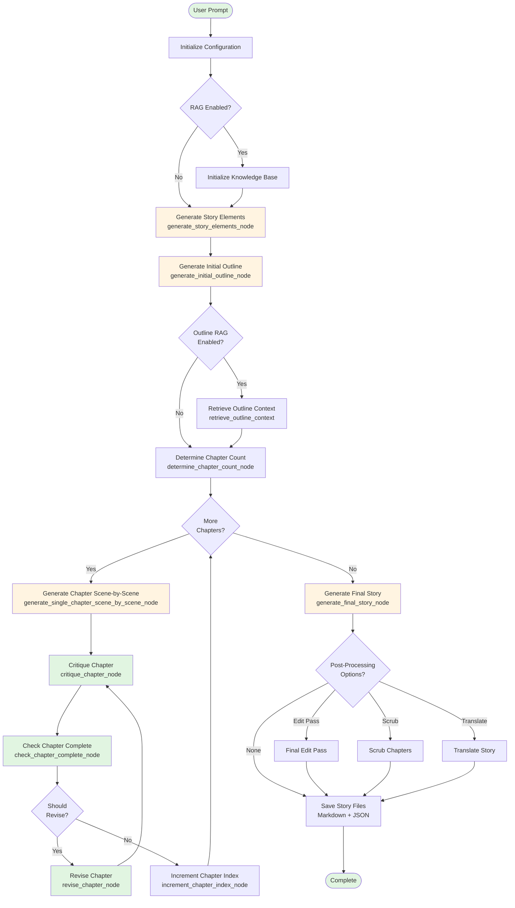
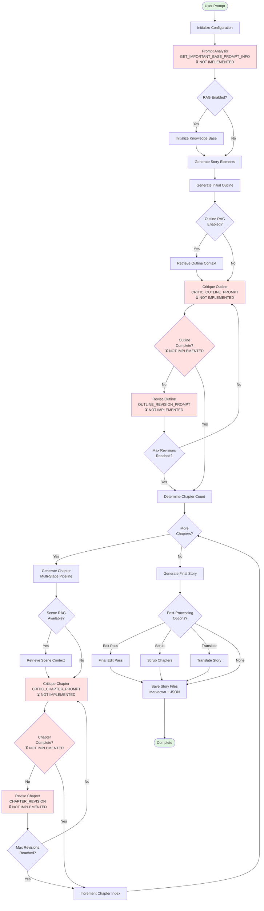

# Application Logic Diagrams

This document provides visual representations of the Storytelling package workflow using Mermaid diagrams.

## Current Implementation: With Chapter Revision Loop

This diagram shows the currently implemented workflow in `storytelling/graph.py`:

## Envisioned Workflow: With Critique and Revision Loops

This diagram shows the intended workflow with critique and revision loops (specified but not yet implemented):

## Node Comparison Table

| Node/Feature | Status | Implementation | Prompts Used |
|-------------|--------|----------------|--------------|
| **Initialize Configuration** | ✅ Implemented | `storytelling/config.py` | - |
| **Prompt Analysis** | ⏳ Not Implemented | - | `GET_IMPORTANT_BASE_PROMPT_INFO` |
| **Generate Story Elements** | ✅ Implemented | `generate_story_elements_node` | `STORY_ELEMENTS_PROMPT` |
| **Generate Initial Outline** | ✅ Implemented | `generate_initial_outline_node` | `INITIAL_OUTLINE_PROMPT` |
| **Critique Outline** | ⏳ Not Implemented | - | `CRITIC_OUTLINE_PROMPT` |
| **Check Outline Complete** | ⏳ Not Implemented | - | `OUTLINE_COMPLETE_PROMPT` |
| **Revise Outline** | ⏳ Not Implemented | - | `OUTLINE_REVISION_PROMPT` |
| **Determine Chapter Count** | ✅ Implemented | `determine_chapter_count_node` | `CHAPTER_COUNT_PROMPT` |
| **Generate Chapter** | ✅ Implemented | `generate_single_chapter_scene_by_scene_node` | `CHAPTER_GENERATION_STAGE1-4` |
| **Critique Chapter** | ✅ Implemented | `critique_chapter_node` | `CRITIC_CHAPTER_PROMPT` |
| **Check Chapter Complete** | ✅ Implemented | `check_chapter_complete_node` | `CHAPTER_COMPLETE_PROMPT` |
| **Revise Chapter** | ✅ Implemented | `revise_chapter_node` | `CHAPTER_REVISION` |
| **Generate Final Story** | ✅ Implemented | `generate_final_story_node` | `STATS_PROMPT` |

## Configuration Parameters Status

| Parameter | Status | Description |
|-----------|--------|-------------|
| `outline_min_revisions` (default: 1) | ⏳ Not Used | Outline revision not yet implemented |
| `outline_max_revisions` (default: 3) | ⏳ Not Used | Outline revision not yet implemented |
| `chapter_min_revisions` (default: 1) | ✅ Used | Minimum revisions before completion check |
| `chapter_max_revisions` (default: 3) | ✅ Used | Maximum revisions regardless of completion |
| `no_chapter_revision` (default: False) | ⏳ Not Used | Override flag not yet implemented |

## Implementation Roadmap

### ✅ Completed

1. **Chapter Critique/Revision Nodes** (Implemented 2024-12-19):
   - ✅ `critique_chapter_node` using `CRITIC_CHAPTER_PROMPT`
   - ✅ `check_chapter_complete_node` using `CHAPTER_COMPLETE_PROMPT`
   - ✅ `revise_chapter_node` using `CHAPTER_REVISION`
   - ✅ `should_revise_chapter` conditional logic
   - ✅ Integrated `chapter_min_revisions` and `chapter_max_revisions` config parameters

### ⏳ Remaining

1. **Add Prompt Analysis Node**: Create node that uses `GET_IMPORTANT_BASE_PROMPT_INFO` to extract context
2. **Add Outline Critique/Revision Nodes**:
   - Create `critique_outline_node` using `CRITIC_OUTLINE_PROMPT`
   - Create `check_outline_complete_node` using `OUTLINE_COMPLETE_PROMPT`
   - Create `revise_outline_node` using `OUTLINE_REVISION_PROMPT`
   - Add conditional edges based on completion status and revision counts
   - Integrate `outline_min_revisions` and `outline_max_revisions` config parameters
3. **Add `no_chapter_revision` Override**: Allow skipping chapter revision via config flag

The chapter revision loop transforms the single-pass workflow into an iterative refinement system that advances stories through structured feedback loops.
