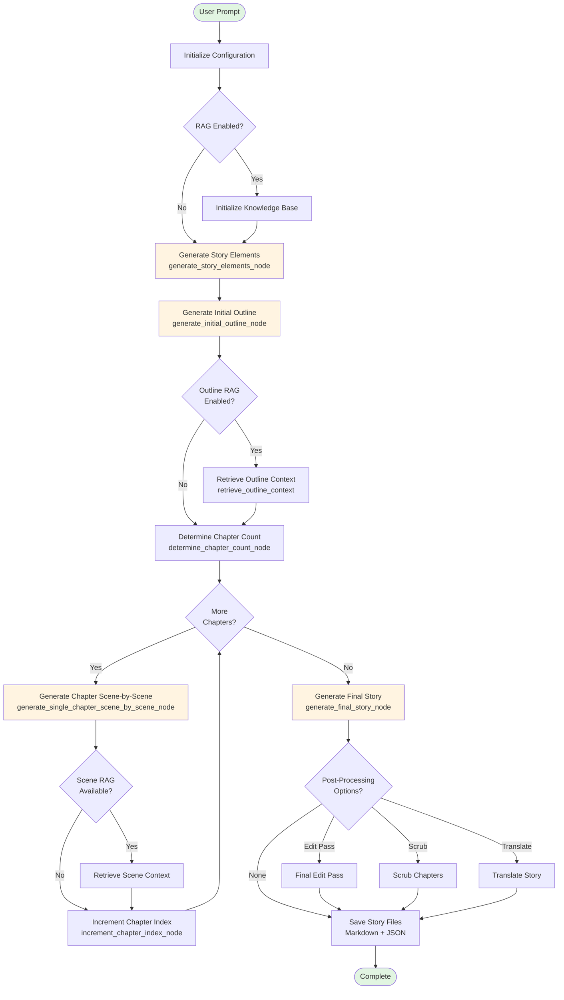

# Application Logic Diagrams

This document provides visual representations of the Storytelling package workflow using Mermaid diagrams.

## Current Implementation: Single-Pass Workflow

This diagram shows the currently implemented workflow in `storytelling/graph.py`:

## Envisioned Workflow: With Critique and Revision Loops

This diagram shows the intended workflow with critique and revision loops (specified but not yet implemented):

## Node Comparison Table

| Node/Feature | Status | Implementation | Prompts Used |
|-------------|--------|----------------|--------------|
| **Initialize Configuration** | ✅ Implemented | `storytelling/config.py` | - |
| **Prompt Analysis** | ⏳ Not Implemented | - | `GET_IMPORTANT_BASE_PROMPT_INFO` |
| **Generate Story Elements** | ✅ Implemented | `generate_story_elements_node` | `STORY_ELEMENTS_PROMPT` |
| **Generate Initial Outline** | ✅ Implemented | `generate_initial_outline_node` | `INITIAL_OUTLINE_PROMPT` |
| **Critique Outline** | ⏳ Not Implemented | - | `CRITIC_OUTLINE_PROMPT` |
| **Check Outline Complete** | ⏳ Not Implemented | - | `OUTLINE_COMPLETE_PROMPT` |
| **Revise Outline** | ⏳ Not Implemented | - | `OUTLINE_REVISION_PROMPT` |
| **Determine Chapter Count** | ✅ Implemented | `determine_chapter_count_node` | `CHAPTER_COUNT_PROMPT` |
| **Generate Chapter** | ✅ Implemented | `generate_single_chapter_scene_by_scene_node` | `CHAPTER_GENERATION_STAGE1-4` |
| **Critique Chapter** | ⏳ Not Implemented | - | `CRITIC_CHAPTER_PROMPT` |
| **Check Chapter Complete** | ⏳ Not Implemented | - | `CHAPTER_COMPLETE_PROMPT` |
| **Revise Chapter** | ⏳ Not Implemented | - | `CHAPTER_REVISION` |
| **Generate Final Story** | ✅ Implemented | `generate_final_story_node` | `STATS_PROMPT` |

## Configuration Parameters Status

These parameters are defined in `storytelling/config.py` but not utilized due to missing critique/revision nodes:

- `outline_min_revisions` (default: 1) - ⏳ Not Used
- `outline_max_revisions` (default: 3) - ⏳ Not Used
- `chapter_min_revisions` (default: 1) - ⏳ Not Used
- `chapter_max_revisions` (default: 3) - ⏳ Not Used
- `no_chapter_revision` (default: False) - ⏳ Not Used

## Implementation Roadmap

To achieve the envisioned workflow with critique/revision loops:

1. **Add Prompt Analysis Node**: Create node that uses `GET_IMPORTANT_BASE_PROMPT_INFO` to extract context
2. **Add Outline Critique/Revision Nodes**: 
   - Create `critique_outline_node` using `CRITIC_OUTLINE_PROMPT`
   - Create `check_outline_complete_node` using `OUTLINE_COMPLETE_PROMPT`
   - Create `revise_outline_node` using `OUTLINE_REVISION_PROMPT`
   - Add conditional edges based on completion status and revision counts
3. **Add Chapter Critique/Revision Nodes**:
   - Create `critique_chapter_node` using `CRITIC_CHAPTER_PROMPT`
   - Create `check_chapter_complete_node` using `CHAPTER_COMPLETE_PROMPT`
   - Create `revise_chapter_node` using `CHAPTER_REVISION`
   - Add conditional edges based on completion status and revision counts
4. **Integrate Configuration Parameters**: Use `outline_min_revisions`, `outline_max_revisions`, `chapter_min_revisions`, `chapter_max_revisions` in loop control logic
5. **Test Iterative Refinement**: Validate that critique loops improve story quality

This roadmap would transform the current single-pass workflow into an iterative refinement system that advances stories through structured feedback loops.
